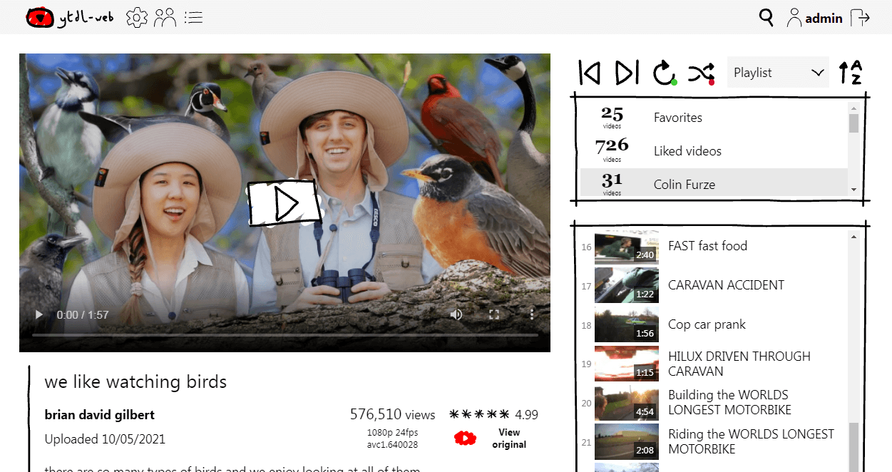
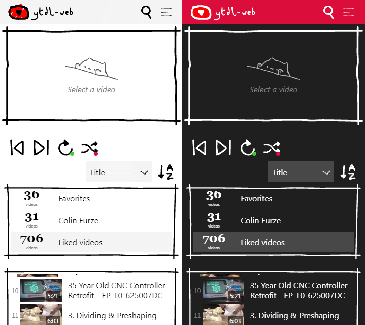

# youtube-dl-web-viewer: A web viewer for your downloaded videos

If you're anything like me, you have a mess of folders filled with videos you've archived using [youtube-dl](https://github.com/ytdl-org/youtube-dl). youtube-dl-web-viewer gathers these into a pleasant web interface so you can access and stream them from anywhere.



## Features

* Scans a folder for playlists (subfolders) and videos
* Collects metadata from filenames or .info.json files
* Generates small thumbnails for display
* Scheduled rescans for new videos and playlists
* Responsive interface for desktop and mobile
* Background playback and media notifications for mobile
* Full-text search for videos
* User management and guest access
* Dark mode
* Pretty cute imo



## Installation

These instructions have been tested on Debian and Cygwin, but should work on most OSs with a little modification. youtube-dl-web-viewer is written in Python 3 (tested with 3.6+), so install it if you haven't already:

>Debian/Ubuntu: `sudo apt install python3`  
>Cygwin: Install the python38 package.  

You will also need some system packages:

>Debian/Ubuntu: `sudo apt install python3-dev python3-setuptools python3-pip python3-venv python3-wheel`  
>Cygwin: Install python38-devel, python38-setuptools, python38-pip, python38-virtualenv, python38-wheel  

And some more for thumbnail generation support:

Debian (and similar Linux): `sudo apt install zlib1g-dev libjpeg8-dev libwebp-dev`  
MacOS: `brew install libjpeg webp`  
Cygwin: Install zlib-devel, libjpeg-devel, libwebp-devel  

Download this repo as a .zip file, extract it and enter the directory:
`cd youtube-dl-web-viewer`

Create and activate a virtual environment:

`python3 -m venv venv`  
`. venv/bin/activate`  

Ensure pip and wheel are up to date:

`pip install --upgrade pip`  
`pip install --upgrade wheel`  

We require a recent version of the sqlite3 library for full-text search. If you're using an earlier Python version than 3.8, manually install the latest version and ytdl-web will use it if available:

`pip install pysqlite3-binary`

Install the Pillow library for thumbnail generation. The easy_install method uses your system's libraries for zlib, jpeg and webp that we installed earlier (see the settings page later if you're having trouble):

`easy_install Pillow`

Install the rest of the project's requirements:

`pip install -r requirements.txt`

Finally, create an instance folder, copy `config.py-dist` to `instance/config.py` and set the secret key to something random to protect your user sessions:

`mkdir instance`  
`cp config.py-dist instance/config.py`  
`nano config.py`  

```
# Secret key: set this to something random to protect your sessions
SECRET_KEY = 'super super secret'
```

You should now be able to start the development server with `flask run` and check it's accessible at `https://127.0.0.1:5000`. It's up to you how you'd like to run it for real – I use apache2 as my web server, so here's how to set it up with that:

### Serving with apache2

Install the libapache2-mod-wsgi-py3 package:

`sudo apt install libapache2-mod-wsgi-py3`

Edit your virtualhost config and add something similar to the following between the `<VirtualHost></VirtualHost>` tags:

`sudo nano /etc/apache2/sites-available/default.conf`

```
WSGIDaemonProcess ytdlweb threads=5 python-home=/path/to/youtube-dl-web-viewer/venv
WSGIScriptAlias /video /path/to/youtube-dl-web-viewer/app/flaskapp.wsgi

<Directory /path/to/youtube-dl-web-viewer/app/>
        WSGIProcessGroup ytdlweb
        WSGIApplicationGroup %{GLOBAL}
        Require all granted
</Directory>
```

Replace `/path/to/youtube-dl-web-viewer` as appropriate. `/video` is the web path to serve the project from, so if your site was `https://example.com` you would access it at `https://example.com/video`.

Next, copy `app/flaskapp.wsgi-dist` to `app/flaskapp.wsgi` and update the path to youtube-dl-web-viewer:

`cd app/`  
`cp flaskapp.wsgi-dist flaskapp.wsgi`  
`nano flaskapp.wsgi`  

```
sys.path.insert(0, '/path/to/youtube-dl-web-viewer')
```

Finally, you'll need to make sure that the user your webserver runs as can execute the app and create the database. The easiest way to do this is to give the webserver's group ownership of the app, and allow it to write to the instance folder:

`chgrp -R www-data /path/to/youtube-dl-web-viewer`  
`chmod g+w /path/to/youtube-dl-web-viewer/instance`  

Reload apache2 with `sudo service apache2 reload` and test! If you get lost, [the Flask documentation](https://flask.palletsprojects.com/en/1.1.x/deploying/mod_wsgi/) is a good place to start.

When you load the web interface for the first time, you'll be prompted to create the database followed by an admin user. Once you've done this you'll be brought to the settings page to fill in your paths – you'll find further instructions here.

## Caveats

This project is only for fun and probably full of bugs (contributions welcome!). The web interface is written in pure HTML, CSS and vanilla Javascript but will likely only work in fairly recent browsers. If you're worried about security, it'll happily run behind HTTP basic auth.